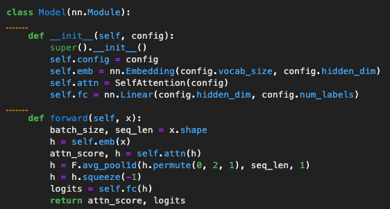
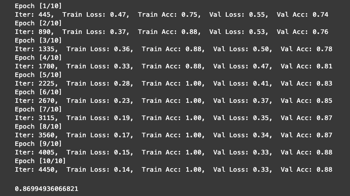
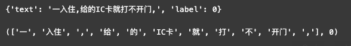
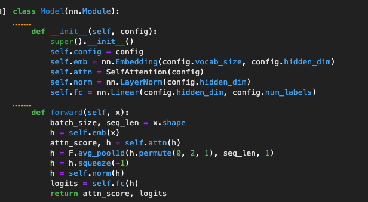
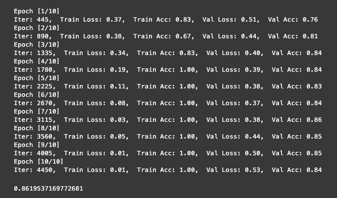
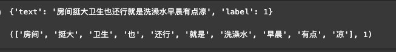
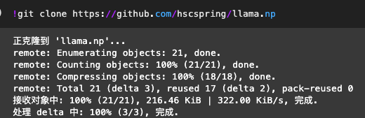
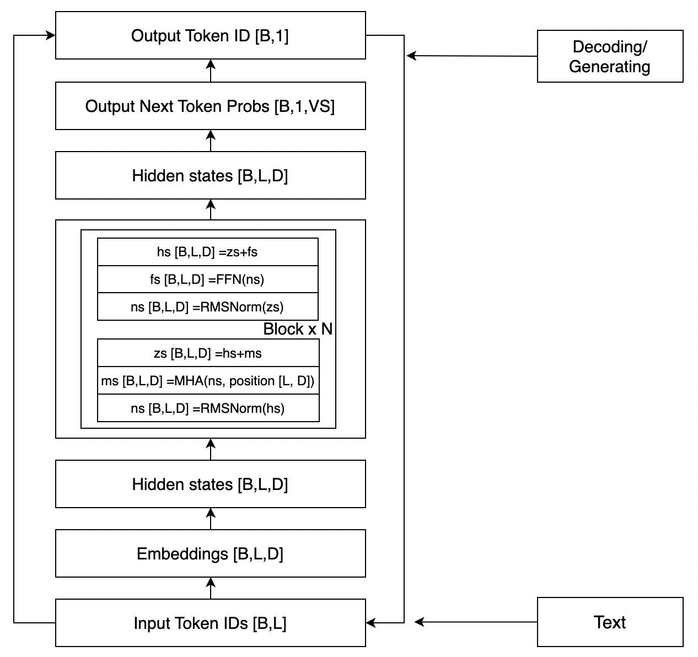

## Transformer LLM学习笔记
#### 1. Attention

Attention机制是一种在处理时序相关问题的时候常用的技术，主要用于处理序列数据。

核心思想是在处理序列数据时，网络应该更关注输入中的重要部分，而忽略不重要的部分，它通过学习不同部分的权重，将输入的序列中的重要部分显式地加权，从而使得模型可以更好地关注与输出有关的信息。
具体的计算步骤如下：

计算查询（Query）：查询是当前时间步的输入，用于和序列中其他位置的信息进行比较。
计算键（Key）和值（Value）：键表示序列中其他位置的信息，值是对应位置的表示。键和值用来和查询进行比较。
计算注意力权重：通过将查询和键进行内积运算，然后应用softmax函数，得到注意力权重。这些权重表示了在当前时间步，模型应该关注序列中其他位置的重要程度。
加权求和：根据注意力权重将值进行加权求和，得到当前时间步的输出。
在Transformer中，Self-Attention 被称为"Scaled Dot-Product Attention"，其计算过程如下：
  1) 对于输入序列中的每个位置，通过计算其与所有其他位置之间的相似度得分（通常通过点积计算）。
  2) 对得分进行缩放处理，以防止梯度爆炸。
  3) 将得分用softmax函数转换为注意力权重，以便计算每个位置的加权和。
  4) 使用注意力权重对输入序列中的所有位置进行加权求和，得到每个位置的自注意输出。
 

#### 2.Tokenizer分词
在使用GPT BERT模型输入词语常常会先进行tokenize ，tokenize的目标是把输入的文本流，切分成一个个子串，每个子串相对有完整的语义，便于学习embedding表达和后续模型的使用。

tokenize有三种粒度：word/subword/char

1) word/词，词，是最自然的语言单元。对于英文等自然语言来说，存在着天然的分隔符，如空格或一些标点符号等，对词的切分相对容易。但是对于一些东亚文字包括中文来说，就需要某种分词算法才行。顺便说一下，Tokenizers库中，基于规则切分部分，采用了spaCy和Moses两个库。如果基于词来做词汇表，由于长尾现象的存在，这个词汇表可能会超大。像Transformer XL库就用到了一个26.7万个单词的词汇表。这需要极大的embedding matrix才能存得下。embedding matrix是用于查找取用token的embedding vector的。这对于内存或者显存都是极大的挑战。常规的词汇表，一般大小不超过5万。
2) char/字符，即最基本的字符，如英语中的'a','b','c'或中文中的'你'，'我'，'他'等。而一般来讲，字符的数量是少量有限的。这样做的问题是，由于字符数量太小，我们在为每个字符学习嵌入向量的时候，每个向量就容纳了太多的语义在内，学习起来非常困难。
3) subword/子词级，它介于字符和单词之间。比如说'Transformers'可能会被分成'Transform'和'ers'两个部分。这个方案平衡了词汇量和语义独立性，是相对较优的方案。它的处理原则是，常用词应该保持原状，生僻词应该拆分成子词以共享token压缩空间。

#### 3. Transformer 案例实践
文本分类实验，二分类文本，近5K文本样本

模型case1: transformer结构， Embedding + 单层SelfAttention + MLP, 

模型case2: transformer结构, Embedding + 单层SelfAttention + LayerNorm + MLP

####4. 结合Numpy实现的llama实例
下载llama numpy实现

LLaMA模型结构

 1) Tokenizer
 2) Decoder
 3) Transformer Block

