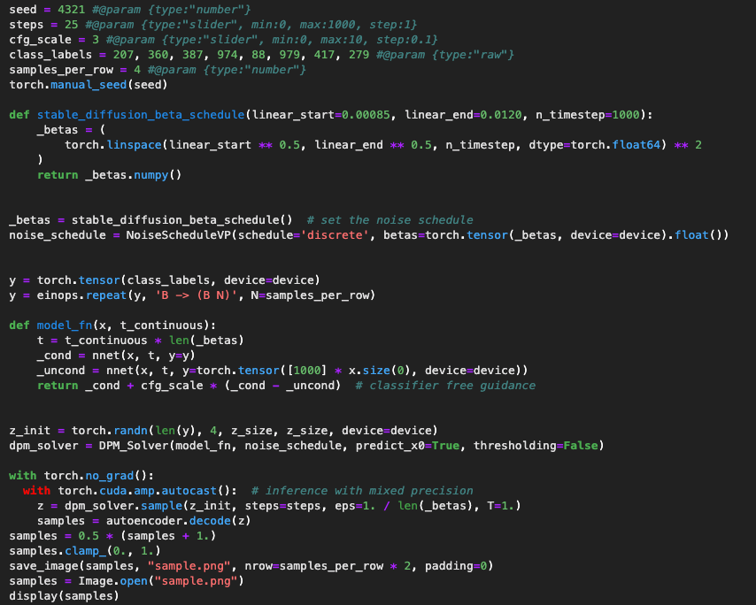
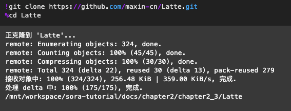
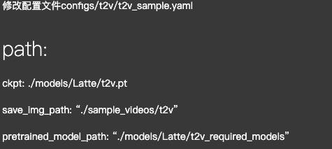

# Video Generation相关方法学习笔记
## 1. ViT
#### 1) 什么是ViT
Vision Transformer (ViT) 模型由 Alexey Dosovitskiy等人在 An Image is Worth 16x16 Words: Transformers for Image Recognition at Scale 中提出。这是第一篇在 ImageNet 上成功训练 Transformer 编码器的论文，与熟悉的卷积架构相比，取得了非常好的结果。论文提出，虽然 Transformer 架构已成为自然语言处理任务事实上的标准，但其在计算机视觉中的应用仍然有限。 在视觉中，attention要么与卷积网络结合应用，要么用于替换卷积网络的某些组件，同时保持其整体结构不变。 ViT证明这种对 CNN 的依赖是不必要的，直接应用于图像块序列（patches）的纯 Transformer 可以在图像分类任务上表现良好。 当对大量数据进行预训练并转移到多个中型或小型图像识别基准（ImageNet、CIFAR-100、VTAB 等）时，Vision Transformer (ViT) 与SOTA的CNN相比取得了优异的结果，同时需要更少的计算资源来训练，Vision Transformer (ViT) 基本上是 Transformers，但应用于图像。 每个图像被分割成一系列不重叠的块（分辨率如 16x16 或 32x32），并线性embedding，接下来，添加position embedding，并通过编码器层发送。 在开头添加 [CLS] 标记以获得整个图像的表示。 可以在最终隐藏状态之上添加线性分类头以对图像进行分类。

#### 2) ViT模型实例

模型加载：从modelscope社区下载模型，然后加载模型到GPU上。

这段输出是关于一个基于Vision Transformer(ViT)的模型结构的详细描述，该模型被设计用于图像分类任务。具体来说，这是Hugging Face Transformers库中ViTForImageClassification类的一个实例化对象的结构。下面是对各部分组件的解析：

图片加载：

图像处理：常规图像预处理，接受 224x224 的输入分辨率。 使用图像处理器调整大小和标准化。

模型预测:通过 ViT 模型预测发送图像，该模型由一个类似 BERT 的编码器和一个位于 [CLS] 令牌的最后一个隐藏状态之上的线性分类头组成。

    
## 2. ViViT
#### 1) 什么是ViViT
ViViT是面向视频的视觉转换器(Video ViT)。视频是由一系列图像组成的。假设你已经拥有一个图像表示模型（如卷积神经网络CNNs、视觉转换器ViTs等）和一个序列模型（如循环神经网络RNNs、长短期记忆网络LSTMs等）。我们请你对这些模型进行调整以实现视频分类任务。直觉上，你会先将图像模型应用于单个帧，然后使用序列模型学习图像表示的顺序。在学习到的序列表示上应用一个分类头部便完成了视频分类模型。使用CNN-RNN架构进行视频分类详细解释了这一方法。更进一步，你还可以构建一种混合式Transformer-based模型来实现视频分类，如使用Transformers进行视频分类所示。

Arnab等人提出的ViViT：视频视觉转换器。作者提出了一种基于纯Transformer的模型用于视频分类任务。作者创新性地提出了一个嵌入方案，并为处理视频剪辑设计了许多Transformer变体。在这个示例中，我们将实现该嵌入方案以及其中一个简化版的Transformer架构。
#### 2）ViViT模型实例

超参数设置：基于特定的超参数搜索选定的。

数据集：在本示例中，我们使用的数据集是MedMNIST v2：一个用于二维和三维生物医学图像分类的大规模轻量级基准。该数据集中的视频文件体积小且易于训练。

数据预处理：

数据dataloader：tf.data pipeline如下

视频Patches的Tubelet Embedding: 在ViTs（视觉转换器）中，一幅图像会被划分为多个patch，随后进行空间维度上的展平并投影作为token化方案。对于视频，可以对单个帧重复这一过程。正如作者所建议的，均匀帧采样是一种token化方案，即从视频片段中抽样出帧，然后执行简单的ViT token化操作。

而Tubelet Embedding则在捕捉时间信息方面有所不同。从视频中，我们提取出包含多个连续帧的体积。这些体积不仅包含了帧的patch，还包含了时间信息。接着，将这些体积进行展平和投影，以便构建视频tokens。

位置编码：向编码后的视频tokens添加position embedding。

Video Vision Transformer(ViViT):作者提出了四种Video Vision Transformer的方式：

    空间-时间注意力机制
    因子分解编码器
    因子分解自我注意力机制
    因子分解点积注意力机制
在这个示例中，为了简化起见，我们将实现 空间-时间注意力机制 模型。以下代码片段大量借鉴自 使用Video Vision Transformer进行图像分类

模型训练:

模型推理：

## 3.U-ViT
模型准备：

模型加载：

VAE加载：

图像生成：class作为条件生成

## 4. Latte
环境准备：

模型加载：

配置文件：

视频生成：

## 相关资料参考
  [1] https://github.com/datawhalechina/sora-tutorial